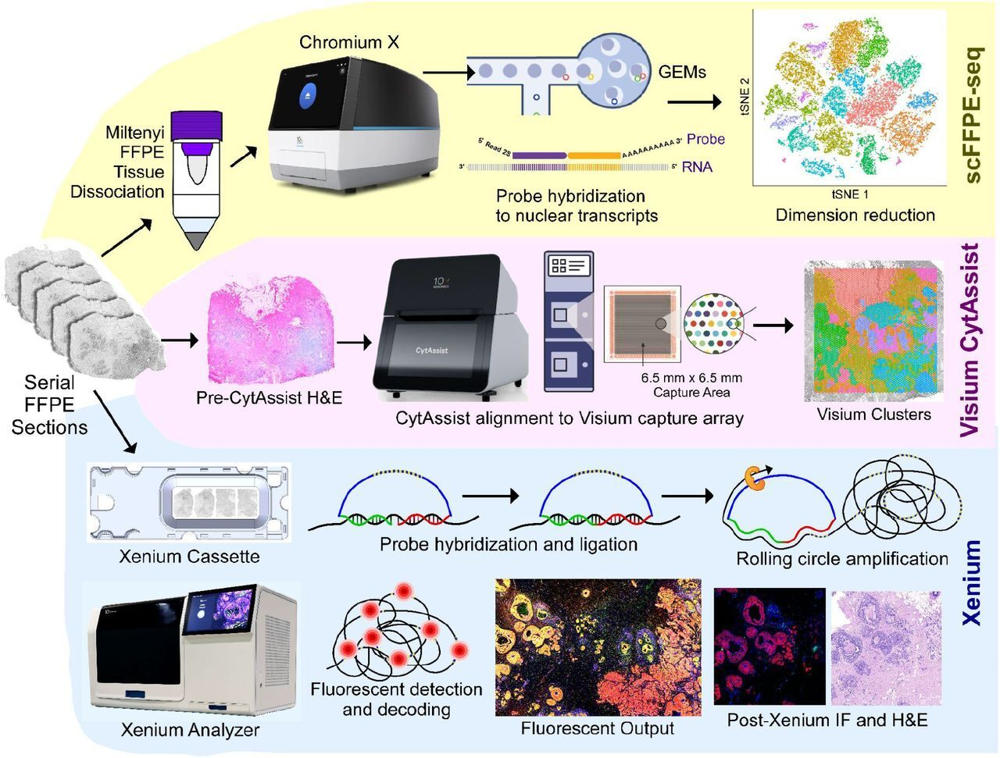
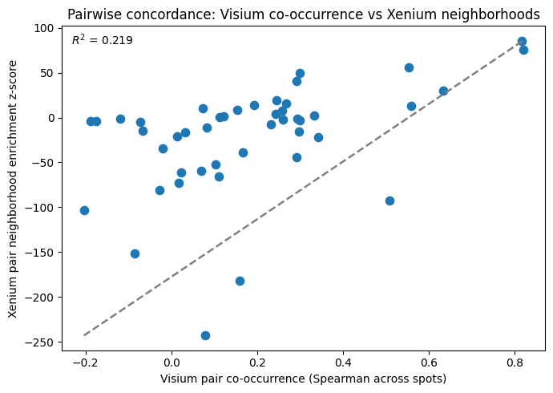

# Visium-Xenium-reference mapping playground

## Introduction

<figure>
<p align="center">
  
</p>
  <figcaption align="center"><b>Figure.</b> Experimental design utilizing all three major 10x Genomics platforms
  for spatial transcriptomics analysis. Figure copied from the publication by <a href="https://doi.org/10.1038/s41467-023-43458-x">Janesick et al Nat. Commun. 2023.</a></figcaption>
</figure>
</br></br>

My goal: *Which cell states inferred in 10x Visium co-occur in the same regions, and are those co-occurrences supported by real cell-cell neighborhoods in 10x Xenium?*

This is a toy project designed to help me work with mostly with Xenium, but alsso Visium and scFFPE-seq datasets together and explore ways to integrate them. You can find my code in the `notebooks` folder.

I explore a single FFPE tissue of breast cancer block (Stage II-B, ER + /PR − /HER2 +) analyzed
with a trio of complementary technologies scFFPE-seq, Visium and Xenium by <a href="https://doi.org/10.1038/s41467-023-43458-x">Janesick et al Nat. Commun. 2023</a>. As far as I know, its the first round of such analysis being done at that time.
Datasets were obtained from the GEO repository under id [GSE243280](https://www.ncbi.nlm.nih.gov/geo/query/acc.cgi?acc=GSE243280) and 
[Xenium FFPE Human Breast with Custom Add-on Panel](https://www.10xgenomics.com/datasets/xenium-ffpe-human-breast-with-custom-add-on-panel-1-standard)

Overview of the platforms:
- **scFFPE-seq**  technology designed to perform high-throughput single-nucleus RNA sequencing on archival, formalin-fixed paraffin-embedded (FFPE) tissue samples from 10x Genomics. It is well suited for building a reference atlas from archived FFPE samples.
  - Readout: next-generation sequencing
  - Coverage: targeted fixed RNA panel
  - Resolution: single-cell
  - Output matrix: cell × gene
- **Visium** is a sequencing-based spatial transcriptomics technology from 10x Genomics. It is well suited for capturing global tissue architecture and
gives whole-transcriptome spatial context but at spot level (mixed cells per spot).
  - Readout: next-generation sequencing
  - Coverage: whole transcriptome
  - Resolution: ~55 µm spots (typically containing 2-10 cells)
  - Output matrix: spot × gene
- **Xenium** is an imaging-based spatial transcriptomics platform from 10x Genomics. It is well suited for high-resolution, cell-level spatial analysis and gives single-cell spatial positions but usually a targeted panel (fewer genes).
  - Readout: microscopy imaging
  - Coverage: targeted gene panel (typically 100-5000 genes)
  - Resolution: single-cell to subcellular
  - Output matrix: cell × gene

How to **combine** them? A practical strategy is to use **scFFPE-seq** as the reference atlas (to to learn what cell types/states look like molecularly), use that reference to deconvolve mixed **Visium** spots into likely cell-type proportions and then use **Xenium** to validate whether those inferred co-occurrences are truly adjacent at single-cell resolution.

In practice:
1. Build a high-quality annotated scFFPE-seq reference.
2. Deconvolve Visium spots using the reference (for example, with cell2location).
3. Test whether co-occurring Visium cell states are supported by true Xenium neighborhoods.


Some useful links:
- intro to models and methods for spatial transcriptomics by Ben Raphael (CGSI 2023) https://www.youtube.com/watch?v=CRuSrd8JWI0
- https://spatialdata.scverse.org - I find it a bit better in teh context of spatial transcirptomics to the sc-best-practices tutorial (https://www.sc-best-practices.org/spatial/introduction.html)


## Tech stack

**Core single-cell & spatial analysis:** 

🧬 scanpy • anndata • squidpy

**Probabilistic modeling & deconvolution:** 

🧬 scvi-tools • cell2location

**Spatial data infrastructure:** 

🧬 spatialdata  • spatialdata-io

**General analysis & plotting:** 

🧬 pandas • numpy • matplotlib


## Repository structure:
```text
visium-xenium-reference-mapping/
├── env/
├── data/
│   ├── reference/
│   ├── visium/
│   └── xenium/
├── notebooks/
│   ├── 01_reference_qc_annotation.ipynb
│   ├── 02_visium_qc_exploration.ipynb
│   ├── 03_visium_cell2location.ipynb
│   ├── 04_xenium_loading_qc.ipynb
│   ├── 05_xenium_annotation_neighborhoods.ipynb
│   └── 06_cross_platform_validation.ipynb
└── src/
```

## Project steps

My steps:

- Get the reference into a solid annotated AnnData.
- Run Visium + cell2location.
- Load Xenium and transfer the same labels and markers.
- Run cross-platform validation in Notebook 06:
  - matched cell types between Visium and Xenium
  - abundance/fraction concordance plots
  - pairwise Visium A-B co-occurrence vs Xenium A-B neighborhood z comparison


Results are reasonable, but the cross-platform concordance is quite moderate. This is a first-pass integration and validation analysis on this dataset by me. Additional QC (at the cell/spot level), more careful label transfer/lifting across platforms, and tighter harmonization of cell-state definitions could improve agreement in future iterations.
<figure>
<p align="center">
  
</p>
  <figcaption align="center"><b>Figure.</b> Pairwise comparison of Visium A-B co-occurrence and Xenium A-B neighborhood enrichment (z-score).</figcaption>
</figure>
</br></br>